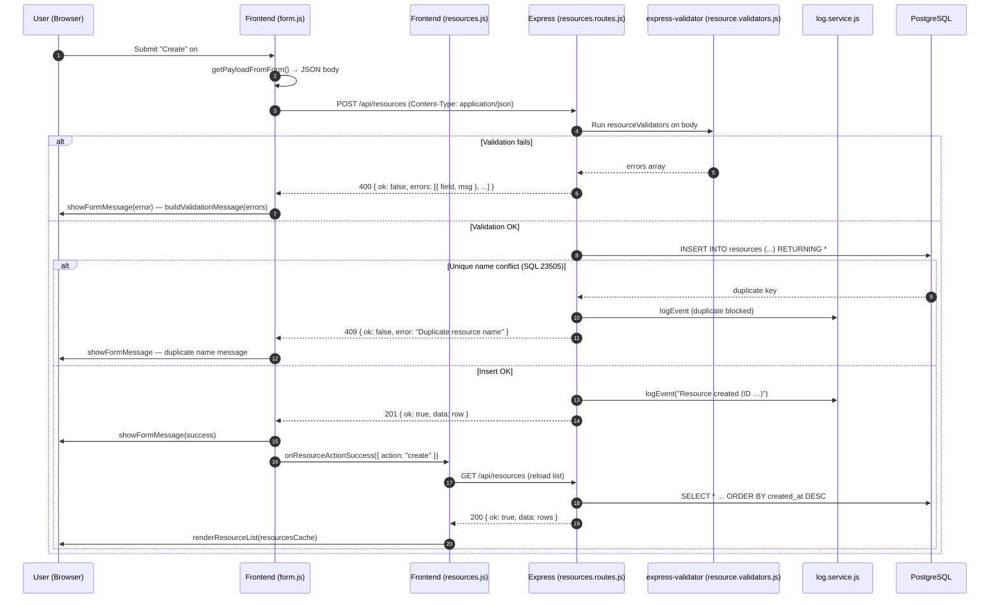
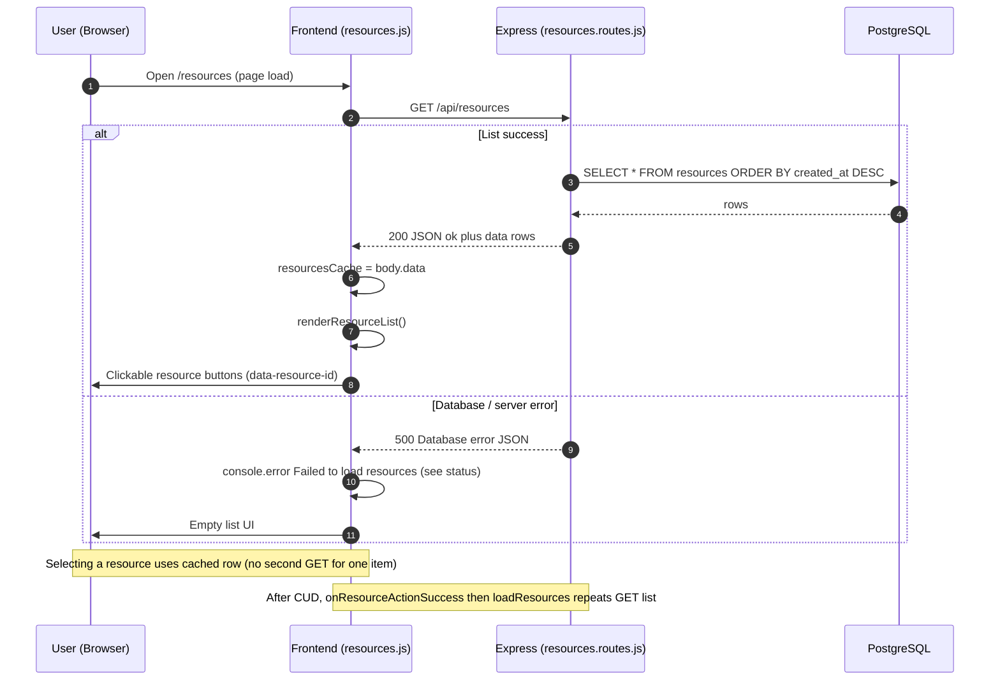
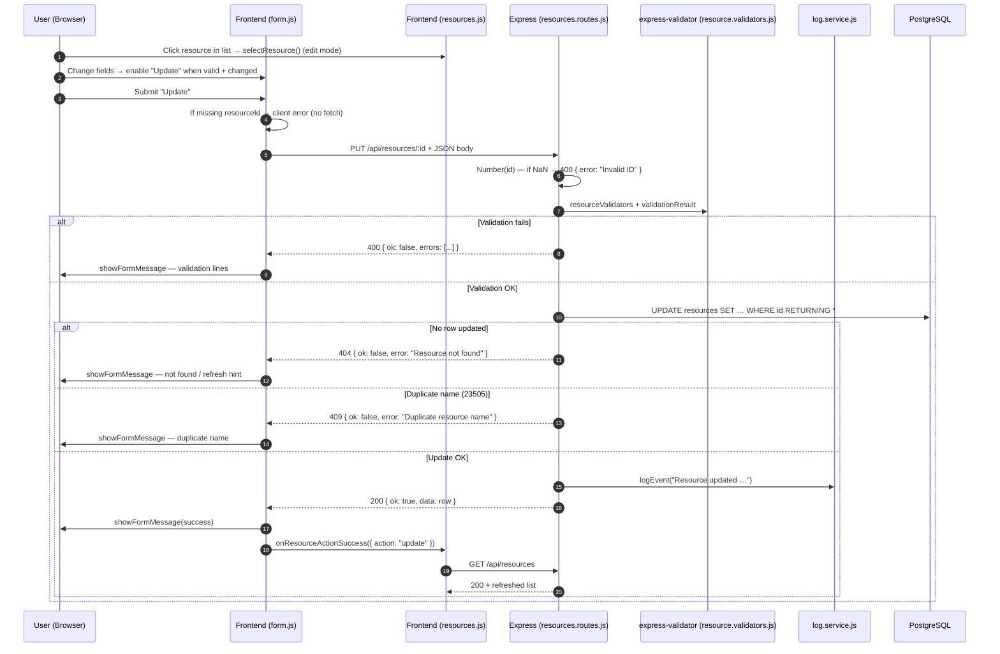
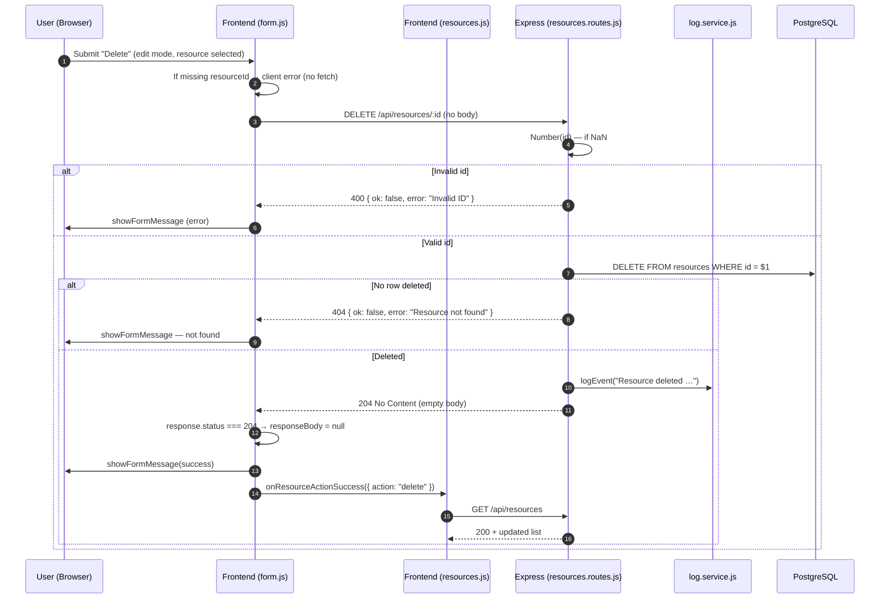

# G1 — CRUD data flow (Phase6 Booking System)

Phase6 stores resources in Postgres and exposes them under `/api/resources`. Below is how **Create, Read, Update, Delete** work in the code I used from the course ZIP (`BookingSystemPhase6`).

Main files:

- `public/form.js` — form submit, `fetch` for POST/PUT/DELETE
- `public/resources.js` — loads the list with `GET /api/resources`, edit mode, `onResourceActionSuccess` refresh
- `src/routes/resources.routes.js` — Express routes
- `src/validators/resource.validators.js` — validation on POST and PUT
- `src/services/log.service.js` — writes to `booking_log` after create/update/delete (not on plain GET)

**Endpoints (what I saw in Network + quick HTTP tests)**

| Operation | Method | Path | Success |
|-----------|--------|------|---------|
| Create | POST | `/api/resources` | 201 + JSON |
| Read list | GET | `/api/resources` | 200 + `{ ok, data: [...] }` |
| Read one | GET | `/api/resources/:id` | 200 + one row (API has this; the list page uses cache when you click a row) |
| Update | PUT | `/api/resources/:id` | 200 + JSON |
| Delete | DELETE | `/api/resources/:id` | 204, no body |

---

## CREATE — POST /api/resources

---

## READ — GET /api/resources (and GET /api/resources/:id)

Opening `/resources` runs `loadResources()` in `resources.js` → `fetch("/api/resources")`. Clicking a list item does **not** call `GET /:id`; it reads from `resourcesCache`. The route `GET /api/resources/:id` still exists on the server (good for testing invalid id / missing row).

Extra checks on **read one** (curl/Postman): bad id → 400 `Invalid ID`; id that does not exist → 404; valid id → 200 with the row.

---

## UPDATE — PUT /api/resources/:id

---

## DELETE — DELETE /api/resources/:id

---

## DevTools

- **Network:** method + URL as in the table; POST/PUT send JSON with `resourceName`, `resourceDescription`, `resourceAvailable`, `resourcePrice`, `resourcePriceUnit`.
- **Delete:** 204 has no body — `form.js` skips JSON parse for 204.
- **Console:** failed list load logs in `resources.js`; network errors log in `form.js`.

---

## Tests (Docker + localhost)

I ran Phase6 with Docker (`docker compose up`) and hit `http://localhost:5000` (port from `.env`). Same URLs as in the browser Network tab.

| Check | Request | Result |
|--------|---------|--------|
| Read list | GET /api/resources | 200 + data array |
| Create | POST /api/resources | 201 |
| Create bad body | POST | 400 |
| Duplicate name | POST | 409 |
| Read one | GET /api/resources/:id | 200 if exists |
| Read one bad id | GET /api/resources/notanumber | 400 |
| Read one missing | GET /api/resources/99999 | 404 |
| Update | PUT /api/resources/:id | 200 |
| Update duplicate name | PUT | 409 |
| Update missing id | PUT /api/resources/99999 | 404 |
| Delete | DELETE /api/resources/:id | 204 empty |
| Delete again | DELETE same id | 404 |

Course materials: AdvWebDev2026K → Phase6 → `BookingSystemPhase6.zip`.
