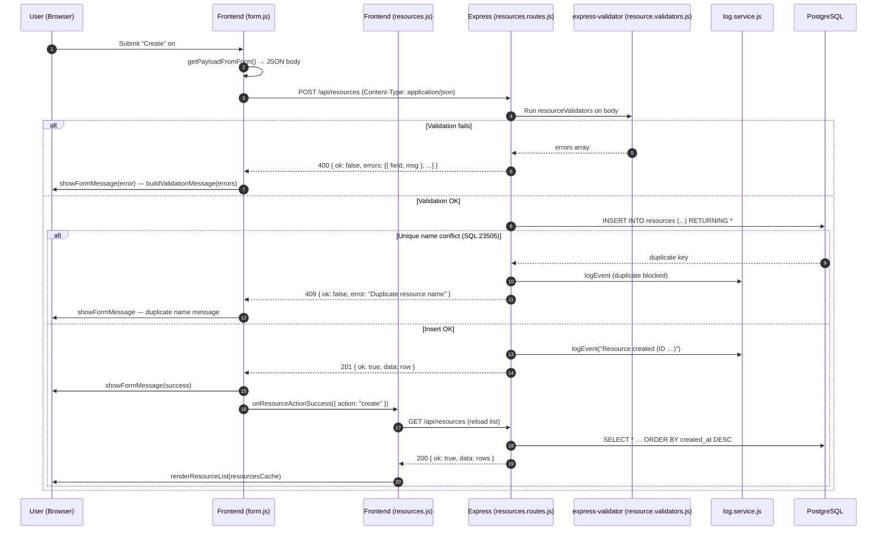
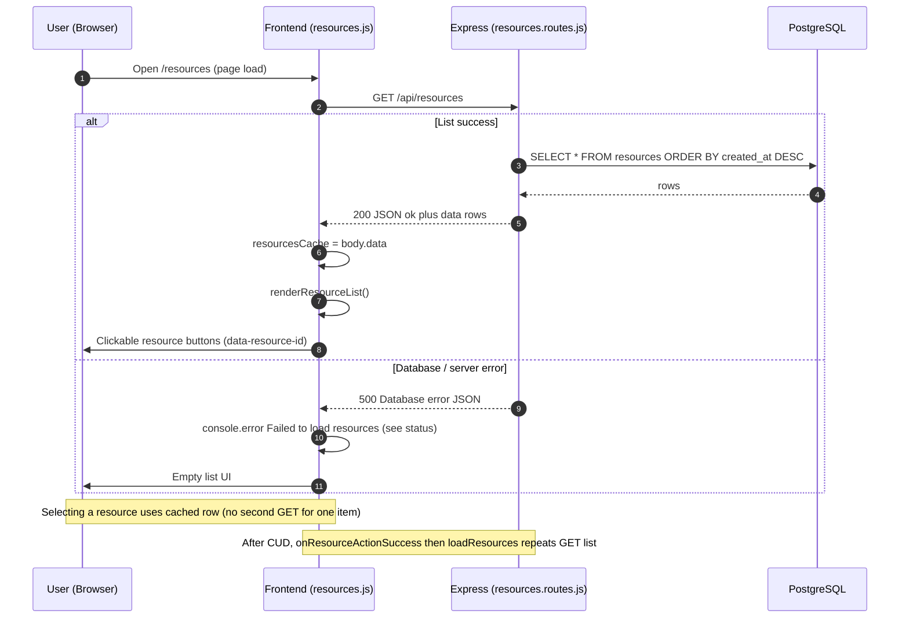
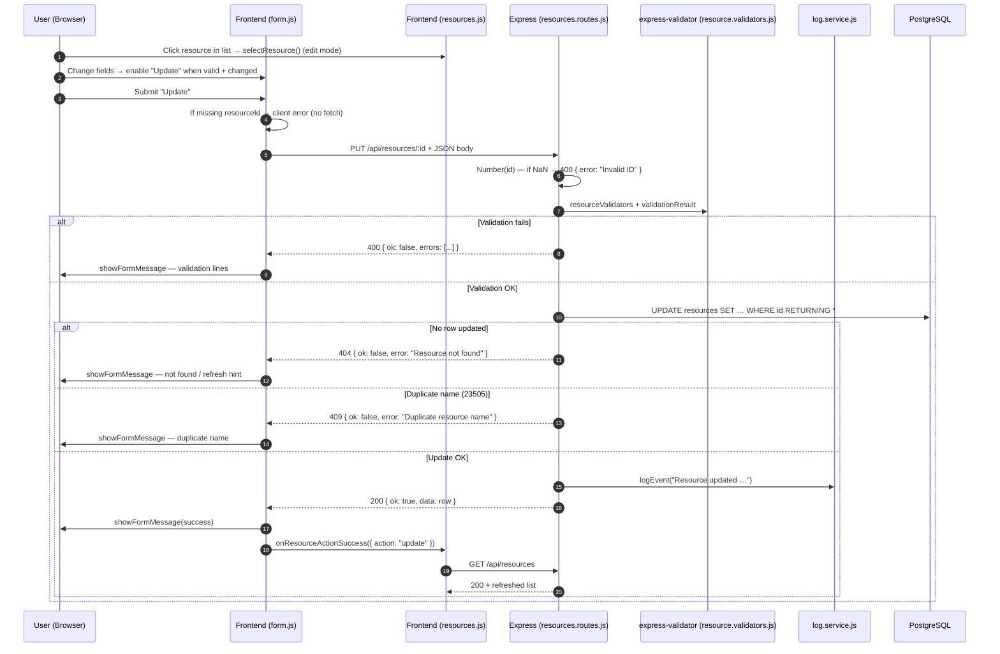
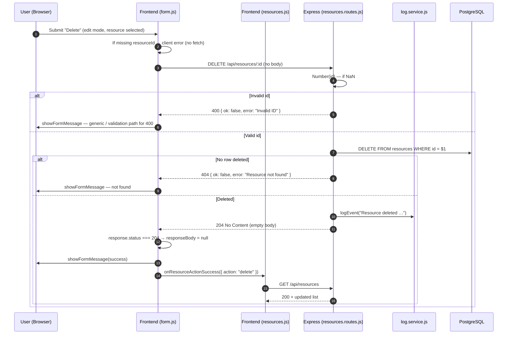

# G1 — CRUD Data Flow (Phase6 Booking System)

This document models how **Phase6** handles **Create**, **Read**, **Update**, and **Delete** for the `resources` API. Flows are aligned with the codebase:

- **Frontend:** `public/form.js` (submit → `fetch`), `public/resources.js` (list load, edit mode, `window.onResourceActionSuccess` refresh).
- **Backend:** `src/app.js` mounts `src/routes/resources.routes.js` at **`/api/resources`**.
- **Validation:** `src/validators/resource.validators.js` (`express-validator`) on **POST** and **PUT**.
- **Persistence:** `src/db/pool.js` → PostgreSQL (`resources` table in `db/init/001_create_resources.sql`).
- **Audit logging (C / U / D only):** `src/services/log.service.js` → `booking_log` (logging failures are non-fatal).

**Observed HTTP surface**

| Operation | Method | Path | Typical success |
|-----------|--------|------|-----------------|
| Create | `POST` | `/api/resources` | `201 Created` + JSON body |
| Read (list) | `GET` | `/api/resources` | `200 OK` + `{ ok, data: [...] }` |
| Read (one) | `GET` | `/api/resources/:id` | `200 OK` + `{ ok, data: {...} }` *(implemented in API; list UI uses cache after list load)* |
| Update | `PUT` | `/api/resources/:id` | `200 OK` + JSON body |
| Delete | `DELETE` | `/api/resources/:id` | `204 No Content` *(empty body)* |

---

## CREATE — `POST /api/resources`

---

## READ — `GET /api/resources` (and optional `GET /api/resources/:id`)

The **resources page** loads the list on startup via `loadResources()` in `resources.js` (`fetch("/api/resources")`). Selecting a row fills the form from **`resourcesCache`** (no second request). The backend also implements **`GET /api/resources/:id`** (invalid id → `400`, missing row → `404`, found → `200`) for clients that fetch a single resource by id.

**Read-one API** (`GET /api/resources/:id`, not used by the list UI): `GET …/not-a-number` → `400` `"Invalid ID"`; `GET …/999999` where row missing → `404` `"Resource not found"`; `GET …/1` → `200` `{ ok: true, data: row }`.

---

## UPDATE — `PUT /api/resources/:id`

---

## DELETE — `DELETE /api/resources/:id`

---

## Console & Network notes (DevTools)

- **Network:** Match **Method** and **URL** to the table above; **Create/Update** send `Content-Type: application/json` with `resourceName`, `resourceDescription`, `resourceAvailable`, `resourcePrice`, `resourcePriceUnit`.
- **Delete:** `204` responses have **no JSON body** — `form.js` treats `204` before `readResponseBody()`.
- **Console:** On failed list load, `resources.js` logs `Failed to load resources:` with status; `form.js` logs `Fetch error:` on network failure.

---

## Runtime verification (Docker + HTTP)

Phase6 was run with `docker compose up -d --build` from the Phase6 project folder (`.env` maps **`EPORT=5000`** → app). The following were checked against **`http://localhost:5000`** (same requests the browser **Network** tab shows; you can repeat in DevTools or with curl/Invoke-WebRequest):

| Check | Request | Result |
|--------|---------|--------|
| Read list | `GET /api/resources` | `200`, `{ "ok": true, "data": [...] }` |
| Create | `POST /api/resources` (valid JSON body) | `201`, `{ "ok": true, "data": { ... } }` |
| Create validation | `POST` with invalid body | `400`, `{ "ok": false, "errors": [...] }` |
| Create duplicate | `POST` same `resourceName` (case-insensitive unique index) | `409`, `{ "ok": false, "error": "Duplicate resource name" }` |
| Read one | `GET /api/resources/:id` | `200` + row when present |
| Read one | `GET /api/resources/notanumber` | `400` `"Invalid ID"` |
| Read one | `GET /api/resources/99999` (missing row) | `404` `"Resource not found"` |
| Update | `PUT /api/resources/:id` (valid body) | `200`, `{ "ok": true, "data": { ... } }` |
| Update duplicate | `PUT` with name that clashes with another row | `409` |
| Update missing | `PUT /api/resources/99999` | `404` |
| Delete | `DELETE /api/resources/:id` | `204` **empty body** |
| Delete missing | `DELETE` same id again | `404` |

---

*Phase6 source: `BookingSystemPhase6` (AdvWebDev2026K Materials). Diagrams reflect `src/routes/resources.routes.js`, `public/form.js`, and `public/resources.js`.*
